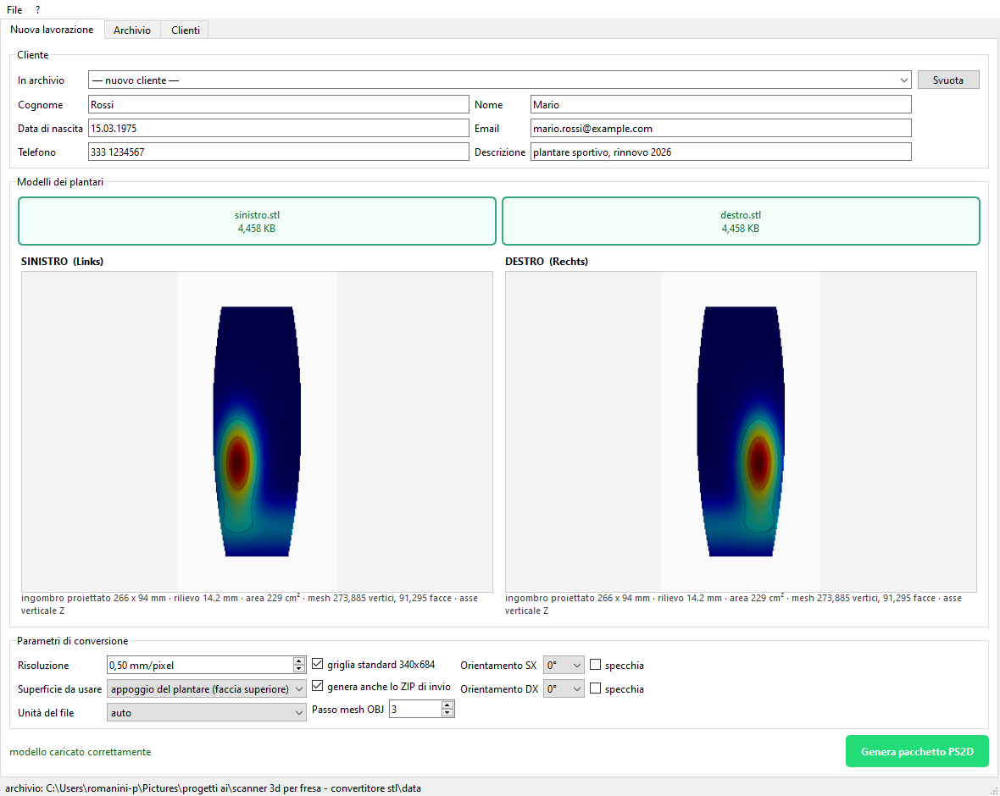

# Gestionale Plantari — convertitore PS2D

Gestionale desktop per laboratori ortopedici: carica i modelli 3D dei
plantari destro e sinistro, li converte nel formato **PS2D** letto dal
software della fresa, e tiene l'archivio dei clienti e delle lavorazioni.



## Cosa fa

- **Anagrafica** — cognome, nome, data di nascita, contatti; i clienti
  restano in archivio e si richiamano dalla volta successiva.
- **Caricamento** — i modelli di destro e sinistro si trascinano nella
  finestra. Formati letti: STL, OBJ, PLY, OFF, 3MF, GLB, GLTF.
- **Anteprima** — mappa a colori con isoipse ogni 5 mm, per controllare
  orientamento, ingombro e altezza dell'arco prima di generare il pacchetto.
- **Esportazione** — produce il `.ps2d` con i sei layer per piede e, se
  serve, lo ZIP di invio con il `manifest.json`.
- **Archivio** — ogni lavorazione conserva i modelli originali, quindi un
  pacchetto si può rigenerare anche a distanza di mesi.

## Installazione

```bash
py -3 -m pip install -r requirements.txt
py -3 main.py --controlla        # verifica che sia tutto a posto
```

## Uso

```bash
py -3 main.py                          # interfaccia grafica
py -3 main.py --ispeziona file.ps2d    # cosa c'è dentro un pacchetto
```

## Il formato PS2D

Un `.ps2d` è **uno ZIP** contenente sei file per piede: `Links` è il
sinistro, `Rechts` il destro. La geometria vive nel `.sca`, una mappa di
quote a 16 bit su griglia da 0,5 mm; gli altri layer sono immagini, la mesh
OBJ e i metadati anagrafici.

Non esiste documentazione ufficiale del formato: la specifica in
[`docs/FORMATO_PS2D.md`](docs/FORMATO_PS2D.md) è stata ricostruita
analizzando pacchetti autentici e verificata rigenerandoli.

## Precisione

| Prova | Errore medio | Errore massimo |
|---|---|---|
| superficie analitica nota | 0,003 mm | 0,032 mm |
| andata e ritorno su scansione reale | 0,02–0,03 mm | p99,9 = 0,10–0,13 mm |

Sulle discontinuità di quota — i bordi del plantare — l'errore sale a
qualche millimetro: è il limite della rappresentazione 2.5D, dove una parete
verticale vista dall'alto ricade sulle celle vicine. La superficie di
appoggio non ne risente.

```bash
py -3 tests\test_precisione.py <pacchetto.ps2d>
py -3 tests\test_flusso.py
```

## Dove si colloca nel flusso di lavoro

Il `.ps2d` non è il file che va alla fresa: è **l'input del software di
modellazione**. Quel programma importa lo ZIP, crea il paziente e apre le
immagini; il plantare si disegna lì dentro e solo alla fine il pezzo va alla
macchina. Questo gestionale serve quindi a far entrare nel flusso scansioni
acquisite con **uno scanner diverso** da quello nativo.

Due avvertenze per le scansioni di altra provenienza: se il modello è il
piede intero la superficie da usare è la **faccia inferiore** — la pianta,
non il dorso — e l'orientamento può differire, perciò l'interfaccia offre
rotazione e specchiatura separate per lato. L'anteprima serve a controllarlo:
l'arco deve risultare rilevato, non incavato.

## Da verificare

Resta da confermare che il software di modellazione apra senza errori un
pacchetto scritto da questo programma. Lo strumento apposito costruisce un
file di prova dalla geometria di una scansione autentica, riscritta per
intero, con anagrafica di fantasia:

```bash
py -3 strumenti\genera_prova_import.py <pacchetto_originale.ps2d>
```

Se si apre come l'originale, il formato è validato. Dettagli in
`obsidian/03-Anomalie/Verifiche aperte.md`.

## Dati personali

L'archivio contiene dati sanitari e **resta sul computer**: la cartella
`data/` è esclusa dal repository, insieme a database e file dei modelli.
Qui c'è solo codice.

## Struttura

```
main.py            avvio
config.py          percorsi, dati della clinica, costanti del formato
src/ps2d/          lettura, scrittura e generazione dei pacchetti
src/db/            archivio SQLite
src/gui/           interfaccia PyQt6
src/servizio.py    orchestrazione, indipendente da Qt
tests/             prove di precisione e di flusso
docs/              specifica del formato
obsidian/          vault di progetto: decisioni, avanzamento, questioni aperte
```
